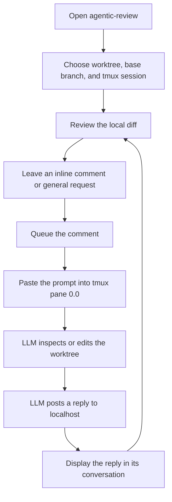

# agentic-review: Product and Design Specification

## 1. Overview

`agentic-review` is a local application for reviewing code changes made by LLM coding agents.

The application brings a GitHub-style code review workflow to changes that have not been pushed to a remote repository. A reviewer can inspect local diffs, attach a comment to a specific changed line or open a general discussion, send the request to an LLM agent running locally, and receive the agent's response in the originating conversation.

The initial product is intended to validate the usability of this interaction model. It does not need to reproduce every GitHub review feature or serve as a permanent review-record system.

### 1.1 Simple use case



The reviewer stays in the browser while the LLM continues to operate in its normal terminal environment. Git supplies the code changes, tmux carries review instructions to the agent, and a loopback HTTP callback carries replies back to the matching conversation.

## 2. Motivation

GitHub's review interface provides a familiar and effective way to understand changes and discuss individual lines. However, it requires changes to be committed or pushed before that interface can be used. This creates unnecessary friction when an LLM agent is making changes locally and the human reviewer wants to guide the agent before publishing anything.

The desired workflow is local and immediate:

1. An LLM agent changes code in a local working directory.
2. The reviewer opens a visual diff without committing or pushing the changes.
3. The reviewer comments on a specific changed line.
4. The application sends the comment to the locally running agent.
5. The agent investigates the code and replies.
6. The response appears under the original inline comment.

This allows human review to become part of the agent's local development loop rather than a separate remote-repository step.

## 3. Product Goals

The application should:

- Present local code changes in a clear, familiar diff interface.
- Offer side-by-side and unified layouts with optional whitespace-difference suppression.
- Support inline comments attached to old or new lines.
- Support general requests that are not attached to a file or line.
- Deliver review comments to an LLM agent running in tmux.
- Receive agent replies through a local network socket.
- Display each reply as part of the corresponding inline thread.
- Queue review comments so a new prompt does not interrupt an agent awaiting a previous reply.
- Allow changed files to be marked reviewed and invalidate that mark when their patch changes.
- Allow completed conversations to be collapsed without deleting them.
- Support several concurrent reviews, each with its own worktree and tmux agent.
- Compare committed and uncommitted changes against a configurable default branch.
- Make switching among reviews and changed files quick and inexpensive.
- Work without pushing changes or creating a pull request.
- Avoid persisting conversations during the initial prototype.
- Keep the architecture portable, even if early testing focuses on Windows with WSL.

## 4. Non-Goals for the Initial Prototype

The first version does not need to provide:

- Pull request creation or Git hosting integration
- Multi-user collaboration
- Authentication beyond protecting the local reply channel
- Permanent review history
- Review data stored in repository files
- Editing sent comments or formal thread-resolution workflows
- Approval states such as Approve or Request Changes
- A complete Git client
- Direct integration with a particular LLM vendor or agent SDK

These features may be considered after the core interaction has been validated.

## 5. Target User

The initial user is a developer who:

- Uses an LLM coding agent in a terminal.
- Runs that agent inside a tmux session.
- Wants to inspect the agent's local changes before committing or pushing them.
- Prefers a visual, line-oriented review workflow over writing review instructions directly in the terminal.
- May have several changed files or tasks that require rapid context switching.

## 6. Core User Experience

### 6.1 Starting a review in a browser tab

Opening the web application in a browser tab creates one independent review context. The application does not implement its own top-level review tabs; users rely on normal browser tabs or windows when they want several reviews open concurrently.

When the page starts, it first presents a setup form requiring three values:

- **Worktree path:** The local Git worktree containing the changes to review.
- **Base branch:** The default branch against which changes are reviewed.
- **tmux session name:** The session containing the LLM agent responsible for those changes.

All three values belong to that browser page's review context and must be provided before its diff view opens. They should not be inherited silently from another browser tab.

As the user types a worktree path, the session field automatically updates to the worktree directory name. The application also inspects the repository and fills the base field with its detected default branch, preferring the remote default and then common local defaults such as `main` or `master`. Both derived values remain editable.

The form may initially suggest the server's current directory. Suggestions are conveniences rather than an implicit binding, and the user can inspect and change all values before starting the review.

Before accepting the form, the application validates that:

- The path exists and is a readable Git worktree.
- The configured base branch exists and resolves to a commit.
- The tmux session exists.
- The server can read the worktree and communicate with the session.

If validation fails, the page remains in its setup state and shows an actionable error. If it succeeds, the page opens the review interface and updates its browser title to identify the worktree or branch.

To start another review, the user opens the application URL in another browser tab or window. Each new page repeats the setup process because it may use a different worktree, base branch, agent session, or combination of them.

### 6.2 Reviewing changes

After the page is initialized, the primary view resembles a desktop diff tool such as P4Diff, with interaction conventions inspired by GitHub's review interface.

The implemented review surface provides:

- A changed-file list for navigating the current review
- A checkbox for hiding or restoring the changed-file pane
- A draggable divider for resizing the changed-file pane
- Side-by-side old and new source views
- A unified diff alternative
- Old and new line numbers
- Clear addition and deletion coloring
- Horizontal and vertical scrolling for long files and lines
- Diff hunk headers and surrounding context
- A visible indication when a line has a discussion
- Checkboxes for ignoring whitespace differences and enabling unified layout
- Controls above and below hunks for expanding unchanged context

Side-by-side is the default layout. Unified mode retains both old and new line numbers so inline discussions remain attached to the correct diff side. Whitespace suppression is performed by Git and affects visualization only; reviewed-file fingerprints continue to use the full patch so hidden changes still invalidate stale review state.

Each hunk provides controls to reveal additional unchanged lines around the change. The server pre-sends a user-configurable context buffer, defaulting to 30 lines, while the client initially renders only three. Expansion consumes that buffer locally in ten-line increments and anchors the first changed line at its existing screen position. When cached context is exhausted, the client requests a geometrically larger buffer, up to 500 lines. A file-level reset collapses visible context without another request.

Selecting a changed file updates the diff in the current page. The application should preserve scroll position and discussion state where practical.

The application does not provide an internal tab bar. Each browser page owns its worktree, base branch, tmux session, changed-file selection, and review discussions. This keeps the UI simpler and uses the browser's existing context-switching behavior.

The page header should make the active context recognizable and expose the review binding directly or through a details panel:

```text
Review: compiler-feature-a
Worktree: /work/projects/compiler-feature-a
Base branch: main
Agent session: compiler-agent-a
Pinned pane: %12 (`compiler-agent-a:0.0`)
```

Changing the page's worktree, base branch, or session should require explicit confirmation because existing threads were created under the previous binding.

### 6.3 Review-context routing invariant

The worktree, base branch, and tmux session form one inseparable review binding:

```text
Browser page -> Worktree + base branch -> Diff and source context
             -> tmux session           -> LLM prompt destination
```

Every diff read, review comment, prompt, reply, refresh, and connection status must be scoped by the browser page's unique review-context identifier. The server must never combine a worktree, base branch, or tmux session from different browser tabs, even when requests arrive concurrently.

### 6.4 Creating an inline comment

The reviewer selects a line number on either side of the diff. The application opens a comment editor associated with:

- The repository
- The review-context identifier
- The worktree configured for that page
- The base branch configured for that page
- The tmux session configured for that page
- The changed file
- The old or new side of the diff
- The corresponding line number
- The current diff context

After the reviewer submits the comment, it appears immediately as the first message in an inline thread and enters that review context's delivery queue. If no earlier thread is awaiting a reply, the application delivers its structured prompt to the pinned tmux pane. Otherwise it remains visibly queued and can be deleted before delivery.

### 6.5 Receiving an agent reply

The injected prompt tells the agent:

- Which review context and worktree are being reviewed
- Which file contains the comment
- Whether the comment refers to the old or working-tree version
- Which line is being discussed
- What the reviewer wrote
- How to return a response to the application

The prompt also assigns a unique thread identifier. The agent posts its response to a localhost socket endpoint using that identifier.

When a valid reply arrives, the application associates it with the original thread and displays it beneath the reviewer's comment. The UI updates without requiring the reviewer to refresh the page.

### 6.6 General discussion

A permanent **General discussion** item appears above the changed files. Selecting it opens a chat-style screen for questions and requests that are not associated with a particular file or line. The screen shows all general threads for the current review context, their delivery states, and the agent's replies.

Submitting a general message creates a thread with `kind: general` and no file, side, or line. Its prompt still identifies the review context, worktree, and base branch, and explicitly tells the agent that the request is not attached to a code line. General messages use the same serialized queue, timeout, cancellation, tmux pane, authenticated callback, hiding behavior, and server-sent events as inline comments. An unsent draft survives background diff refreshes and live reply updates while the page remains open.

## 7. Interaction States

An inline or general thread can move through the following states:

```text
Draft -> Queued -> Sending -> Waiting for agent -> Replied
          |                       \-> Timed out
          \-> Deleted              \-> Delivery failed
```

- **Draft:** The reviewer is writing but has not submitted the comment.
- **Queued:** The comment is waiting behind another active thread and can still be deleted.
- **Sending:** The application is injecting the prompt into tmux.
- **Waiting for agent:** tmux accepted the prompt, but no socket reply has arrived.
- **Replied:** At least one agent response has been received.
- **Timed out:** No reply arrived within the configured interval; the next queued comment may proceed.
- **Delivery failed:** The selected session disappeared or tmux rejected the operation.

The UI should distinguish delivery failure from an agent that is merely taking time to answer.

Each review context has at most one inline or general thread in **Sending** or **Waiting for agent**. Both thread kinds share the same queue. A reply, timeout, or delivery failure releases the next queued thread. A late reply still attaches to its original thread ID but does not affect the newer active thread. Only queued threads can be deleted.

Any conversation can be hidden after the reviewer is done with it. Hiding is a presentation state only: the compact row retains the thread ID and message count, incoming replies are still accepted and announced, and the full comments can be shown again at any time.

### 7.1 Per-file reviewed state

The reviewer can mark any changed file as reviewed using its checkbox in the changed-file list. The server records a fingerprint of that file's complete current patch rather than only its path or modification time. Background diff checks compare the stored fingerprint with the live patch.

If the fingerprint changes or the file disappears from the diff, the reviewed checkbox is cleared. The UI identifies the file as requiring additional review and notifies the user. Checking it again stores the new fingerprint. Reviewed state is transient and scoped to the current browser page's review context.

## 8. High-Level Architecture

The prototype contains three participants:

```text
+----------------------+       tmux input        +----------------------+
|                      | ----------------------> |                      |
| agentic-review       |                         | Terminal LLM agent   |
|                      | <---------------------- |                      |
+----------------------+   localhost reply API   +----------------------+
          |
          | reads
          v
+----------------------+
| Local Git worktree   |
+----------------------+
```

### 8.1 Review application

The application is responsible for:

- Maintaining multiple independent review contexts
- Validating each context's worktree, base branch, and tmux session
- Reading the local Git diff for the active context
- Rendering changed files and hunks
- Serving configurable prefetched context for client-side hunk expansion
- Maintaining transient inline and general threads
- Serializing prompt delivery through a per-review queue
- Tracking reviewed-file patch fingerprints
- Discovering and selecting a tmux session per browser review context
- Building and injecting agent prompts
- Listening for agent replies
- Broadcasting reply updates to the UI

Every browser request that reads a diff or creates a comment identifies its review context. The server resolves the worktree, base branch, and tmux session from server-owned context state instead of trusting those values in each comment request.

### 8.2 Git worktrees

Git remains the source of truth for code changes. Every review context references one local worktree and base branch, and the application does not maintain its own copy of modified files.

The comparison starts at the merge base of the configured base branch and `HEAD`, then ends at the live working tree. This includes feature-branch commits as well as staged, unstaged, and untracked changes. Using the merge base follows pull-request semantics and avoids treating newer commits on the default branch as reverse changes in the feature worktree.

### 8.3 LLM agent in tmux

The application treats the LLM agent as a terminal program rather than depending on a vendor-specific API. This makes the interaction usable with different coding agents as long as they can:

- Receive pasted terminal input
- Inspect the local repository
- Execute a local callback command

### 8.4 Current implementation

The prototype is a dependency-free Node.js 18+ HTTP server with a browser client written in plain HTML, CSS, and JavaScript. It requires no build step. By default it listens only on `127.0.0.1:4173`; `AGENTIC_REVIEW_PORT` can select another port.

The server invokes Git and tmux, owns review bindings, queues, thread state, reviewed-file fingerprints, and the authenticated reply endpoint. The browser parses the unified patch returned by the server and renders either the side-by-side or unified review layout. Server-sent events carry thread and queue updates to the owning page.

While a review page is visible, the browser checks its diff every eight seconds and its tmux connection every ten seconds. These background checks update changed files and invalidate stale reviewed marks without requiring a manual refresh. The default agent-reply timeout is five minutes (`AGENTIC_REVIEW_REPLY_TIMEOUT_MS`), and the default delay between pasting a prompt and sending Enter is one second (`AGENTIC_REVIEW_SUBMIT_DELAY_MS`).

## 9. tmux Communication Design

### 9.1 Session discovery

When a browser page's review context is configured, the application lists available tmux sessions and may suggest an exact match with the worktree directory name. The user confirms or changes the session as part of page setup.

The selected value must refer to an existing session and is stored on that review context. If a session ends while the application is open, only the affected browser page enters a disconnected state. Other browser tabs continue operating normally. The affected page allows the user to reconnect it explicitly.

### 9.2 Prompt injection

Review prompts may contain quotes, newlines, code, and shell-significant characters. The application should therefore avoid building a shell command that embeds the prompt directly.

The preferred mechanism is:

1. Load the complete prompt into a temporary tmux buffer.
2. Paste that buffer into pane `0` of window `0` in the selected session.
3. Delete the temporary buffer.
4. Wait briefly so the terminal agent can finish handling the pasted block.
5. Send Enter as a separate tmux input to submit the prompt.

This uses tmux's keyboard and paste facilities while preserving the prompt text more reliably than shell interpolation.

Pane `session:0.0` is expected to contain the LLM agent. The server resolves and stores its stable tmux pane ID when the review context is created, so switching windows later cannot redirect review prompts. The UI displays the pinned pane ID alongside the session name.

### 9.3 Prompt structure

The injected prompt should be machine-readable enough to avoid ambiguity while remaining understandable to an agent. A conceptual example is:

```text
[agentic-review inline review request]
Review context: <review-context-id>
Worktree: /work/projects/compiler
Base branch: main
File: source/parser.cpp
Location: working-tree version, line 148
Thread ID: <unique-thread-id>

Reviewer comment:
Could this condition accept an empty token?

Treat the comment as an actionable code-review instruction.
If it requests a change, make the change and run focused checks before replying.
If it only asks a question, answer without modifying files.

Post the response to the supplied localhost endpoint using the thread ID
and bearer token.
[end agentic-review request]
```

The prompt contract should instruct the agent to distinguish between a question and a requested code change. For a requested change, the agent must edit the worktree and perform appropriate focused verification before replying; it must not merely describe or promise a future edit. Its reply summarizes changes actually made and checks performed. A comment asking only for explanation does not authorize code modification.

## 10. Reply Socket Design

### 10.1 Transport

The application exposes an HTTP endpoint bound only to the loopback interface. HTTP is used as a simple application protocol over a local network socket because terminal agents can call it with commonly available tools.

A reply contains at least:

```json
{
  "threadId": "unique-thread-id",
  "body": "The condition is guarded by the earlier token check."
}
```

### 10.2 Authentication

The server creates an unpredictable bearer token on each startup. The token is included in the prompt sent to the agent and must be supplied with the callback request.

The reply server should:

- Bind to `127.0.0.1` rather than all interfaces
- Reject missing or incorrect tokens
- Reject unknown thread identifiers
- Limit request sizes
- Validate that reply bodies are non-empty strings

This is protection for a local prototype, not a complete security boundary against other processes running as the same operating-system user.

### 10.3 Live UI updates

After accepting a reply, the server notifies the originating browser page through a server-sent events connection scoped to that review context. The browser updates the corresponding conversation immediately.

## 11. In-Memory Data Model

The prototype can represent review contexts and discussions with the following logical structure:

```text
ReviewContext
  id
  label
  worktreePath
  baseBranch
  resolvedBaseRef
  tmuxSessionName
  pinnedPaneId
  connectionStatus
  reviewedFileFingerprints: Map<file, patchHash>
  commentQueue
  activeThreadId
  replyTimeout
  threads[]

Thread
  id
  reviewContextId
  repository
  kind: inline | general
  file (inline only)
  side: old | new (inline only)
  line (inline only)
  status
  queuedAt
  sentAt
  comments[]

Comment
  id
  author: reviewer | agent
  body
  createdAt

BrowserReviewState
  activeFile
  generalDiscussionSelected
  generalDraft
  hiddenThreads
  invalidatedFiles
  diffLayout: sideBySide | unified
  ignoreWhitespace
  prefetchedContextLines
  visibleContextByHunk
  sidebarVisible
  sidebarWidth
```

Review contexts and threads are transient. Closing or reloading the browser page releases its context when possible, and restarting the server clears all remaining contexts.

Presentation preferences such as sidebar visibility and width, diff layout, whitespace filtering, and context-cache size are stored in browser local storage. Threads, reviewed marks, hidden-thread state, queues, and replies remain in memory only.

No comment data, credentials, or agent responses should be written into the reviewed repository.

## 12. Platform Strategy

The design should avoid unnecessary platform-specific dependencies.

- **Linux:** Native execution with Git and tmux.
- **macOS:** Native execution with Git and an installed tmux.
- **Windows prototype:** The application and agent run under WSL, where tmux is available. The browser UI can be opened from Windows through localhost.

A future desktop package could wrap the browser UI using Electron, Tauri, or another desktop shell. The initial local web application is sufficient to validate the workflow and keeps the review engine independent of the presentation container.

## 13. Failure Handling

The application should provide actionable feedback for common failures:

- A configured worktree path does not exist or is not a Git worktree.
- The configured base branch is invalid, missing, or has no merge base with `HEAD`.
- Git or tmux is not installed.
- No tmux sessions exist.
- A page's selected session does not exist.
- A page's selected session exits before delivery.
- The pinned `session:0.0` pane exits after configuration.
- An agent does not reply before the queue timeout.
- The diff changes while a comment editor is open.
- The agent returns an invalid token or unknown thread ID.
- A reply is not valid JSON.
- The local reply port is already in use.

A failure to initialize or deliver a comment in one browser tab must not disturb other tabs, discard their in-memory threads, or prevent the reviewer from reading their diffs.

## 14. Privacy and Safety

The prototype is local by design:

- Source code is read from the local Git worktree configured for each browser page.
- Review prompts are sent only to the stable pane ID resolved from `session:0.0` when that page's review context is created.
- Replies are accepted only through a loopback socket.
- Review conversations are kept in memory.
- The application does not require a hosted account.

The worktree/base-branch/session binding is a sensitive control point. The application should keep all three values visible or easily inspectable, route comments through server-owned review-context state, and never automatically switch a page to a similarly named session. This reduces the risk of showing the wrong code range or sending instructions to the wrong agent.

Review comments are instructions to an LLM and may contain code or quoted text. The prompt should clearly delimit reviewer content, but the agent is ultimately responsible for following its own permission and safety policies.

## 15. Prototype Acceptance Criteria

The initial concept is successful when a user can:

1. Open the web application in a browser tab.
2. Enter a worktree and see the session field update to its directory name and the base field update to its detected default branch.
3. Edit either suggested value when a different session or base branch is required.
4. Validate the worktree, base branch, and tmux session for that page.
5. See committed, staged, unstaged, and untracked changes since the merge base without pushing them.
6. Open another browser tab with a different review binding.
7. Switch between browser tabs without mixing their diffs, comments, or agent routing.
8. Move quickly among changed files using the file list within a page.
9. Select an old or new line and write a comment.
10. Observe that comment being delivered only to pane `0.0` of the agent session bound to that page.
11. Have the agent send a response through the local reply endpoint.
12. See the response beneath the correct inline comment in the correct browser tab.
13. Complete the workflow without review data being written to a file.
14. Queue several comments without interrupting the agent, delete a queued comment, and see the next comment advance only after a reply, timeout, or delivery failure.
15. Mark a file reviewed and see that mark removed with a visible notification after its patch changes.
16. Resize or hide the file pane, scroll long lines horizontally, switch between side-by-side and unified layouts, and optionally suppress whitespace differences.
17. Expand context above or below a hunk from the client-side cache without losing the changed line's viewport position.
18. Collapse and restore a completed conversation without deleting its history.
19. Open General discussion, send a request without selecting a code line, and receive its reply on the general chat screen through the same serialized queue.

## 16. Possible Future Work

After validating the core workflow, useful extensions include:

- Review staged and unstaged changes separately
- Select a base commit, branch, or arbitrary revision range
- Support several agents and route threads independently
- Allow follow-up reviewer messages within an existing thread
- Mark threads resolved or outdated
- Render Markdown and code suggestions
- Apply agent-proposed patches from the review thread
- Detect when reviewed lines move after an edit
- Add keyboard navigation modeled after established diff tools
- Display the agent's progress while a reply is pending
- Negotiate capabilities through an agent handshake instead of relying only on prompt instructions
- Offer optional persistence outside the reviewed repository
- Package the application as a native desktop executable

## 17. Open Design Questions

The prototype should help answer the following questions before the product expands:

- Beyond the current background refresh, which draft, selection, and scroll states should survive an agent edit?
- What browser-page title best distinguishes reviews: worktree directory, branch, task name, or user-defined text?
- Should two browser tabs be allowed to use the same worktree or the same tmux session?
- How should an agent indicate that it changed code instead of merely replying?
- Should a follow-up comment reuse the agent's existing conversation context or send a complete new prompt?
- What handshake can confirm that the selected pane contains a compatible LLM agent rather than a shell?
- Which review information, if any, should survive an application restart?

These questions are intentionally left open until the basic local inline-review loop has been used in practice.
